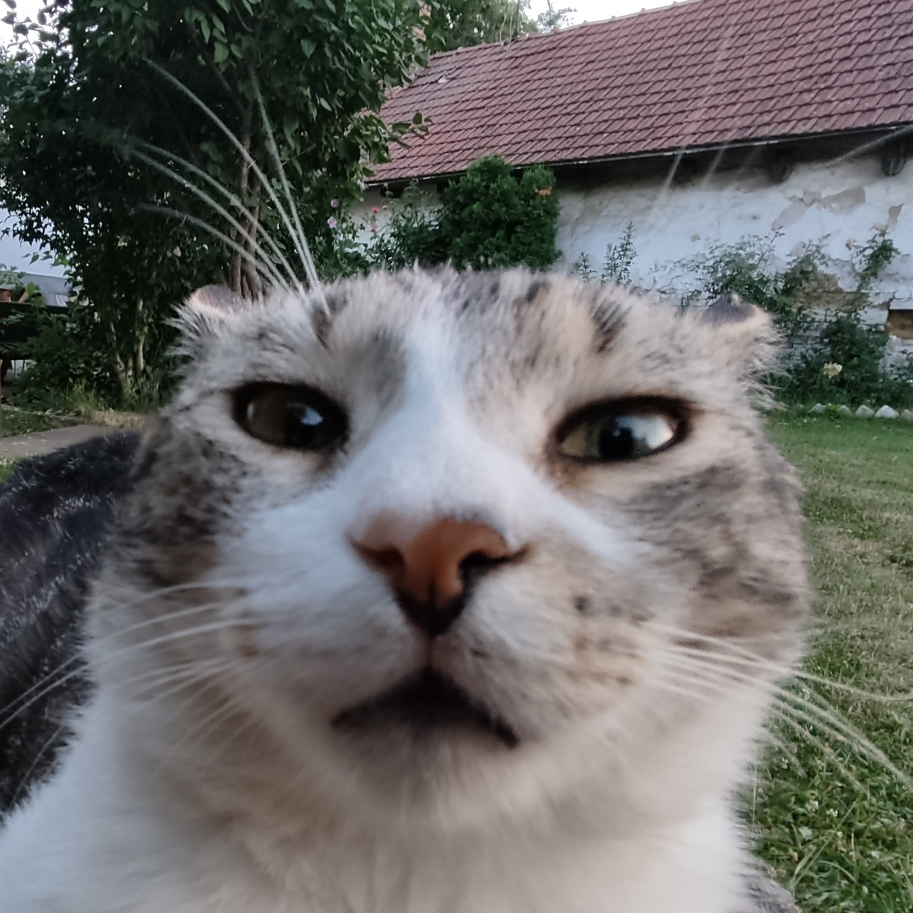

# Multipurpuse telegram bot

## About

Still work in progress.

Originally made just for me and my friends, but feel free to download code and run your own.

I used base bot template from [Telegram.Bot Polling example](https://github.com/TelegramBots/Telegram.Bot.Examples/tree/master/Telegram.Bot.Examples.Polling).

Some of the functions of this bot are:  
1. Fetching Tiktok videos without watermark  
2. Download and optionally compress Reddit videos  
3.  Random APIs  
  - Chuch Norris jokes

And more to come

Feel free to report any issues or contribute!

## Usage

Check /usage message or send Tiktok and Reddit links directly

## Prerequisites

Please make sure you have .NET 6 or newer installed. You can download .NET runtime from the [official site.](https://dotnet.microsoft.com/download)

You have to add [Telegram.Bot](https://www.nuget.org/packages/Telegram.Bot/) 
nuget package to your project to be able to use polling:

```shell
dotnet add package Telegram.Bot
```

(Optional for Reddit) Download and install youtube-dl and FFMPEG and add them to path.  

## Configuration

Edit appsettings.json and set your own token you got from [BotFather](https://telegram.me/BotFather)  

If you want to compress Reddit videos to reduce upload time (and download time when viewing) set CompressVideo key to false.

```json
"BotConfiguration": {
  "BotToken": "{BOT_TOKEN}",
  "CompressVideo": true
}
```

#### ps

This is my cat Mau


